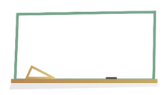

## iOS三方库

<!-- more -->

网络请求

[AFNetworking](https://github.com/AFNetworking/AFNetworking) OC
[Alamofire](https://github.com/Alamofire/Alamofire) Swift

图片加载

[SDWebImage](https://github.com/SDWebImage/SDWebImage) oc
[Kingfisher](https://github.com/onevcat/Kingfisher) swift

自动布局约束

[Masonry](https://github.com/SnapKit/Masonry) OC
[SnapKit](https://github.com/SnapKit/SnapKit) Swift

下拉刷新上拉加载

[MJRefresh](https://github.com/CoderMJLee/MJRefresh)

模型转换

[MJExtension](https://github.com/CoderMJLee/MJExtension) oc
[JSONModel](https://github.com/jsonmodel/jsonmodel) oc

JSON解析

[SwiftyJSON](https://github.com/SwiftyJSON/SwiftyJSON) swift

扩展

[SwifterSwift](https://github.com/SwifterSwift/SwifterSwift)

SVG加载库

[SVGKit](https://github.com/SVGKit/SVGKit)  (v3.0.0某些svg图会有显示不出来问题)

例如：`SVGKit`v3.0.0, 图片

```oc
SVGKImage *image = [SVGKImage imageNamed:@"bg.svg"];
self.imageView.image = image.UIImage;
```

展示出来如下：


基于GPU的图片或视频的处理框架

[GPUImage](https://github.com/BradLarson/GPUImage)

源码级别对GPUImage进行剖析以及尝试
[GPUImageStudy](https://github.com/loyinglin/GPUImage)

ios示例
[iOS_Tips](https://github.com/wsl2ls/iOS_Tips) (oc)

灵动岛
[灵动岛](https://github.com/batikansosun/iOS-16-Live-Activities-Dynamic-Island) (swift)  
[iOS16-Live-Activities](https://github.com/1998code/iOS16-Live-Activities)


引导页：  

[EAIntroView](https://github.com/ealeksandrov/EAIntroView)

导航栏

[HBDNavigationBar](https://github.com/listenzz/HBDNavigationBar)

[WRNavigationBar](https://github.com/wangrui460/WRNavigationBar)

选项卡

[XLPagerTabStrip](https://github.com/xmartlabs/XLPagerTabStrip) (Swift)

滑动切换滚动视图

[JXCategoryView](https://github.com/pujiaxin33/JXCategoryView) (左右滑动切换 OC)
[JXSegmentedView](https://github.com/pujiaxin33/JXSegmentedView) (左右滑动切换 Swift)

[JXPagingView](https://github.com/pujiaxin33/JXPagingView) (多页面嵌套，既可以上下滑动，也可以左右滑动切换页面)

图片选择

[HXPhotoPicker](https://github.com/SilenceLove/HXPhotoPicker)

[ZLPhotoBrowser](https://github.com/longitachi/ZLPhotoBrowser) （4.0以下OC 4.0以上Swift）

[YBImageBrowser](https://github.com/indulgeIn/YBImageBrowser)

[TZImagePickerController](https://github.com/banchichen/TZImagePickerController)

图片浏览器

[KNPhotoBrowser](https://github.com/LuKane/KNPhotoBrowser) (oc)

[GKPhotoBrowser](https://github.com/QuintGao/GKPhotoBrowser) (oc)

徽章

[PPBadgeView](https://github.com/jkpang/PPBadgeView)
[BadgeHub](https://github.com/jogendra/BadgeHub) (Swift)

浮窗

[WMDragView](https://github.com/zhengwenming/WMDragView)

弹出窗

[LSTPopView](https://github.com/LoSenTrad/LSTPopView) (oc)

[YBPopupMenu](https://github.com/lyb5834/YBPopupMenu) (OC)
[PopMenu](https://github.com/CaliCastle/PopMenu) (Swift)

[KLCPopup](https://github.com/jmascia/KLCPopup) (横屏时有缺陷)

[LNPopupController](https://github.com/LeoNatan/LNPopupController)

网页封装

[JXBWKWebView](https://github.com/xiubojin/JXBWKWebView) (oc)

表单列表

[XLForm](https://github.com/xmartlabs/XLForm) (OC)  

[Eureka](https://github.com/xmartlabs/Eureka)（Swift）

TextField

[JVFloatLabeledTextField](https://github.com/jverdi/JVFloatLabeledTextField) 输入框浮动标签提示

轮播图

[SDCycleScrollView](https://github.com/gsdios/SDCycleScrollView) (OC)

[FSPagerView](https://github.com/WenchaoD/FSPagerView) (Swift)

UICollectionView

[IGListKit](https://github.com/Instagram/IGListKit)

搜索历史记录

[PYSearch](https://github.com/ko1o/PYSearch)

内购

[SwiftyStoreKit](https://github.com/bizz84/SwiftyStoreKit) (Swift)

[RMStore](https://github.com/robotmedia/RMStore) (OC)

SwipeCell

[SwipeCellKit](https://github.com/SwipeCellKit/SwipeCellKit) (Swift)

权限

[PermissionsKit](https://github.com/sparrowcode/PermissionsKit) (Swift)

GIF图

[FLAnimatedImage](https://github.com/Flipboard/FLAnimatedImage)

JSON

[ObjectMapper](https://github.com/tristanhimmelman/ObjectMapper) (Swift)

扫描

[SGQRCode](https://github.com/kingsic/SGQRCode)

[LBXScan](https://github.com/MxABC/LBXScan)

文本

[TTTAttributedLabel](https://github.com/TTTAttributedLabel/TTTAttributedLabel)

[YYText](https://github.com/ibireme/YYText)

日历

[FSCalendar](https://github.com/search?q=FSCalendar) (oc)

本地存储

[YYCache](https://github.com/ibireme/YYCache)

数据库

[FMDB](https://github.com/ccgus/fmdb)

应用程序和扩展程序之间的消息传递(进程通讯)

[MMWormhole](https://github.com/mutualmobile/MMWormhole) (oc)

打印

[PrintBeautifulLog](https://github.com/shixueqian/PrintBeautifulLog)

图标库

[图片](https://badgen.net/badge/icon/ios%209.0+?icon=apple&label)

可调节大小，移动的视图

[SPUserResizableView](https://github.com/spoletto/SPUserResizableView)

绘图视图

[ACEDrawingView](https://github.com/acerbetti/ACEDrawingView)

在状态栏上显示FPS状态 检测fps滑动帧

[JPFPSStatus](https://github.com/joggerplus/JPFPSStatus)

视频播放器

[ZFPlayer](https://github.com/renzifeng/ZFPlayer)

[WMPlayer](https://github.com/zhengwenming/WMPlayer) (oc)

WebView桥接

[WebViewJavascriptBridge](https://github.com/marcuswestin/WebViewJavascriptBridge)

UITableViewCell自动高度计算

[FDTemplateLayoutCell](https://github.com/forkingdog/UITableView-FDTemplateLayoutCell)

UICollectionView的布局，将单元格向左对齐

[UICollectionViewLeftAlignedLayout](https://github.com/mokagio/UICollectionViewLeftAlignedLayout)

加载框

[MBProgressHUD](https://github.com/jdg/MBProgressHUD)

KVO

[KVOController](https://github.com/facebookarchive/KVOController)

键盘

[IQKeyboardManager](https://github.com/hackiftekhar/IQKeyboardManager)

列表空数据显示

[DZNEmptyDataSet](https://github.com/dzenbot/DZNEmptyDataSet)

崩溃记录
Bugly

双滑块范围选择器

[SDRangeSlider](https://github.com/Meterwhite/SDRangeSlider)

标签

[TTGTagCollectionView](https://github.com/zekunyan/TTGTagCollectionView)

分段控制

[BetterSegmentedControl](https://github.com/gmarm/BetterSegmentedControl) (Swift)

选择器

[BRPickerView](https://github.com/91renb/BRPickerView) (OC)

模糊试图

[DynamicBlurView](https://github.com/KyoheiG3/DynamicBlurView) （Swift）

蓝牙

[SwiftyBluetooth](https://github.com/jordanebelanger/SwiftyBluetooth) (Swift)  
[BabyBluetooth](https://github.com/coolnameismy/BabyBluetooth) (OC)  

星级评定
[HCSStarRatingView](https://github.com/hsousa/HCSStarRatingView) (oc)

扩展
[JKCategories](https://github.com/shaojiankui/JKCategories) (oc)

侧滑
[FWSideMenu](https://github.com/choiceyou/FWSideMenu) (swift)

[SWRevealViewController](https://github.com/John-Lluch/SWRevealViewController) (oc)

[SwiftSideslipLikeQQ](https://github.com/johnlui/SwiftSideslipLikeQQ) (swift)

设备信息
[GBDeviceInfo](https://github.com/lmirosevic/GBDeviceInfo) (oc)

socket库
[CocoaAsyncSocket](https://github.com/robbiehanson/CocoaAsyncSocket) (oc)

wkwebview封装
[AXWebViewController](https://github.com/devedbox/AXWebViewController) (oc)

CJLabel
[CJLabel](https://github.com/lele8446/CJLabel) (oc)

颜色选择
[MSColorPicker](https://github.com/sgl0v/MSColorPicker) (oc)

列表字母索引视图
[SCIndexView](https://github.com/TalkingJourney/SCIndexView) (oc)

聊天键盘
[XBZChatKeyBoard](https://github.com/BigKingQY/XBZChatKeyBoard) (oc)

滚动
[TOScrollBar](https://github.com/TimOliver/TOScrollBar) (oc)

PDF
[PDFViewAndDownload](https://github.com/fenglinyunshi/PDFViewAndDownload) (oc)

直播
[LFLiveKit](https://github.com/LaiFengiOS/LFLiveKit) (oc)

腾讯云聊天
[TIMSDK](https://github.com/TencentCloud/TIMSDK)

文件下载
[TYDownloadManager](https://github.com/12207480/TYDownloadManager) (oc)  
[SRDownloadManager](https://github.com/guowilling/SRDownloadManager) (oc)
[SODownloader](https://github.com/scfhao/SODownloader) (oc)
[DGDownloadManager](https://github.com/liudiange/DGDownloadManager) (oc)

从状态栏获取网络状态，获取wifi名，获取wifi mac地址，wifi信号强度 (不太行了)
[DetailNetStatus](https://github.com/qianlima210210/DetailNetStatus) (oc)

主题/换肤, 暗色模式
[SwiftTheme](https://github.com/wxxsw/SwiftTheme) (swift)

alert
[SPAlertController](https://github.com/dongxiexidu/SPAlertController) (swift)

[PopupDialog](https://github.com/Orderella/PopupDialog) (swift)

计步
[StepOrient](https://github.com/lioilwin/StepOrient)